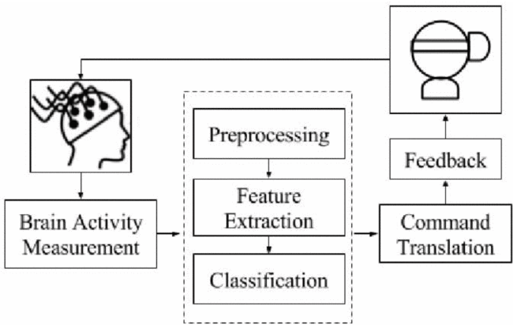

2023-01-17
answers: 
question: basic metric data need ?
- 1. yes we will need some kind of baseline/thresold for the focous, we will need already working musician to train the data, and compare the result and other accuaracy
question: can we use existing hardware in this project?
- 2. like in case existing hardware, VR can catch the EEG, but still it is in the development
- 
- like we can use headphone to modify it(idea by nishq)
- in somekind of sensor or something, from apple watch, we can only get ecg and nuero feedback data, although we found the most compact eeg (https://mentalab.com/mobile-eeg/)
question:there are many levels to this data. a. we first need to understand what kind of different neuro waves are there b. what can be measured by the present sensors. c. what waves are related to what kind of processes & emotions
- there are mainly raw data which comes from the electrodes, more the electrodes we have, we get more data, after proccessing it(converting it from analog to digital and removing the noise and amplifying), after it we get alpha, beta, gamma and thetha, this are stages, jo frequency ke hisab se fiter hota hai 
- in mesuring, different placment have different kind of data attach to it
- for our project following placments are useful for us
Abstract:
- we are trying to create music accoding to whatever the person is thinking or feeling at the moment, like if he is not feeling happy then he can't generate happy music, what he thinks or feels it is transfomed in to music
- till date, we have figured out what placments of electroeds will be useful for us, we will in the basic one need 4 channel headset, and for better data and other accuracy 8-channel will be bset, in 4-channel the muse headset fits the best, for 8-channel one emotive headset is the best, this is on the based on the other people have used in their research, the muse one covers the most electrodes placments we wants, emotive one also does that, on the custome side of headset, we can go for the eeg cap, which gives freedome of using any electrodes placment we want, but it is expensive but highly customisable, and it has learning curve comapre to other already ready to use headset availble headset, so i think we should go with ready made headse for the research!
2023-01-16
- creating music using brain signals: https://www.hindawi.com/journals/cin/2010/267671/
- i don't think we need ecg data, it may be helpful, but alone eeg can do the work
- smallest eeg device: https://mentalab.com/mobile-eeg/
- feasibility of a project:
	- 
	- 
2023-01-13
- analysis of EEG signals:

https://www.neuroelectrics.com/blog/2014/12/18/eeg-signal-processing-for-dummies/

-   Alpha waves (8-13 Hz): These are typically seen when a person is in a relaxed, awake state with closed eyes. They are thought to be associated with visual imagery and relaxation.
    
-   Beta waves (13-30 Hz): These are typically seen when a person is in a state of alertness and attention. They are thought to be associated with active thinking, problem-solving and decision making.
    
-   Theta waves (4-7 Hz): These are typically seen during light sleep, deep relaxation, and meditative states. They are thought to be associated with memory and emotion.
    
-   Delta waves (0.5-4 Hz): These are typically seen during deep sleep. They are thought to be associated with restorative processes such as tissue repair and growth.
    
-   Gamma waves (30-100 Hz): Gamma waves are associated with high-level information processing, such as perception and consciousness.

Some studies suggest that theta and alpha waves are associated with positive emotions and relaxation, while beta and gamma waves are associated with negative emotions and arousal. Additionally, some studies suggest that the coherence between different brain regions, as well as the relative power of different frequency bands, may be associated with different emotions.

It's also worth noting that studies have found that different emotions are associated with different patterns of activity in different brain regions, and that different emotions may be characterized by different combinations of brain waves.

- Some of the main regions of the brain that have been associated with different emotions include:

-   The amygdala: This small almond-shaped structure is located in the temporal lobes of the brain and is thought to be involved in the processing of emotions such as fear and anxiety.
    
-   The ventromedial prefrontal cortex (vmPFC): This region of the brain is located in the front of the brain, and is thought to be involved in the regulation of emotions, particularly positive emotions such as happiness and pleasure.
    
-   The anterior cingulate cortex (ACC): This region of the brain is located in the front of the brain and is thought to be involved in the regulation of emotions, particularly negative emotions such as anger and sadness.
    
-   The insula: This region of the brain is located deep in the cerebral cortex and is thought to be involved in the processing of emotions such as disgust and empathy.
    
-   The hippocampus: This region of the brain is located in the medial temporal lobes, and is thought to be involved in memory formation and recall.
2023-01-12
- EEG signals have two types: scalp EEG and intracranial EEG (iEEG). Scalp EEG signals are usually collected with electrodes placed on the scalp using some sort of conductive gel after treating the scalp area with light abrasion in order to decrease the impedance resulting from dead skin cells.
-  in iEEG, electrodes are placed directly on the exposed surface of the brain during a surgery to record electrical activity from the cerebral cortex.
- Most of the research work in the field of seizure detection depends on scalp EEG signals, which are acquired with non-invasive techniques
- EEG signals are in general non-linear and non-stationary. So, there is a difficulty to characterize different activities of EEG signals with certain mathematical models. (Non-linear means the underlying model is a non-linear ODE. Non-stationary means the time evolution operator is time-dependant) (reference: https://asp-eurasipjournals.springeropen.com/articles/10.1186/1687-6180-2014-183?curius=373)
- nice book : https://www.ncbi.nlm.nih.gov/books/NBK390346/
- best thing i found so far, all the application: http://learn.neurotechedu.com/applications/?curius=373
- have the application listed out, and references also, first time i got to know that there is something word called Neurogaming, and there is whole store for the games([https://store.neurosky.com/collections/apps/games](https://store.neurosky.com/collections/apps/games "https://store.neurosky.com/collections/apps/games"))
- have the application listed out, and references also, first time i got to know that there is something word called Neurogaming, and there is whole store for the games([https://store.neurosky.com/collections/apps/games](https://store.neurosky.com/collections/apps/games "https://store.neurosky.com/collections/apps/games"))
- this is good [https://neurowear.com/necomimi/](https://neurowear.com/necomimi/ "https://neurowear.com/necomimi/") they have actually made end user headset which looks good
- found the video which explains our thing [https://www.youtube.com/watch?v=JyiXQgj_Nfk&t=15s](https://www.youtube.com/watch?v=JyiXQgj_Nfk&t=15s "https://www.youtube.com/watch?v=JyiXQgj_Nfk&t=15s")
- brain disco: [https://neurowear.com/braindisco/](https://neurowear.com/braindisco/ "https://neurowear.com/braindisco/")
- this thing is reverse, they are playing music on subject, and using eeg signals, they are trying to recreate the same melody using eeg , [https://www.frontiersin.org/articles/10.3389/fnins.2021.673401/full?curius=3](https://www.frontiersin.org/articles/10.3389/fnins.2021.673401/full?curius=3 "https://www.frontiersin.org/articles/10.3389/fnins.2021.673401/full?curius=3")
- 
- basic understanding of brain waves: [https://astralcodexten.substack.com/p/book-review-rhythms-of-the-brain?s=r&curius=2003,1346](https://astralcodexten.substack.com/p/book-review-rhythms-of-the-brain?s=r&curius=2003,1346 "https://astralcodexten.substack.com/p/book-review-rhythms-of-the-brain?s=r&curius=2003,1346") explains how brain wave works
- 
**link i need to explore more**:
- creativity with eeg: https://www.frontiersin.org/articles/10.3389/fpsyg.2018.01315/full?curius=1274
- need to deep dive into this: https://www.neuroelectrics.com/blog/2014/12/18/eeg-signal-processing-for-dummies/

2023-01-10
- https://neurosky.com/biosensors/eeg-sensor/
- we first need to finalise hardware requirements with costing in detail(by end of this week),
- eeg cap (cost, works(placement,etc...)?,alternatives)
	- dhyanesh: how it works?, positions of placments, which output we are getting in which form, alternatives, cost
- motherboard(cost, works(channels,which channels are important for us)?,alternatives)
	- yash: will post in the group
- data(which data will be get by the eeg, which will be important, what can we get, what are the possibilities, and what can we do with it, which data to process ?, how to process the data?)
	- karan: which data we can obtain from eeg signals, what is usefull for us from raw eeg signals, what are the possiblities we can do with data, how to deal with the data
- mohit: research about already existing eeg headsets, their difference, how they are different, why they are different, all the possiblities which exist

2023-01-09
- understood what are we actually building, and how much more resoruces and team will require!
- first thing i got clear is, by going in the direction of therphy, we know we will never achive 100% accuracy, so going through all doctor drama is not worth it, like if someone is having sucidal thoughts, and our system fails to detect, and by listning to music, this guy got more depressed, and did sucide, so this kind of things can happen
- i like the other pivot of the idea, like the person wears the headset, and the data goes through it, and the person is now creating music by his emotion, this works because, the person himself doesn't know most of the time, what mood is he, he is not 100% sure, so by even we are able to detect small emotion, and genreate the music, that can be great magic, like i am making music from my emotion!
- need to read isac assimov, left after reading 1st chapter, have to again pick it up!
- talked with the hardware guyes also, they are ready to help, but first i need to do a research, what exactly are our requirements, so my next task is to do hardware level research, which hardware is required to work for eeg, because openbci also has so many boards, and all of them are different for different use cases!