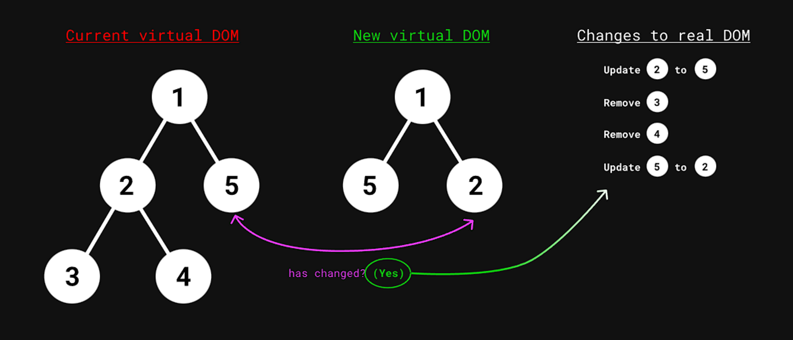
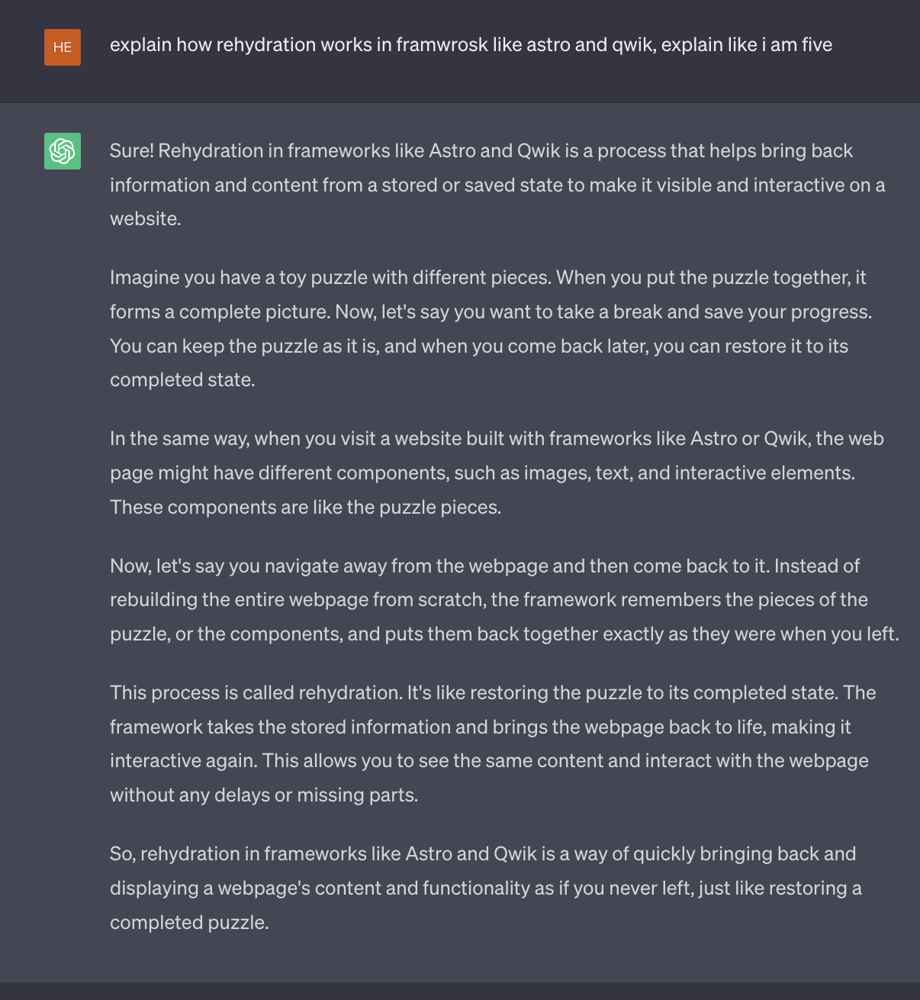
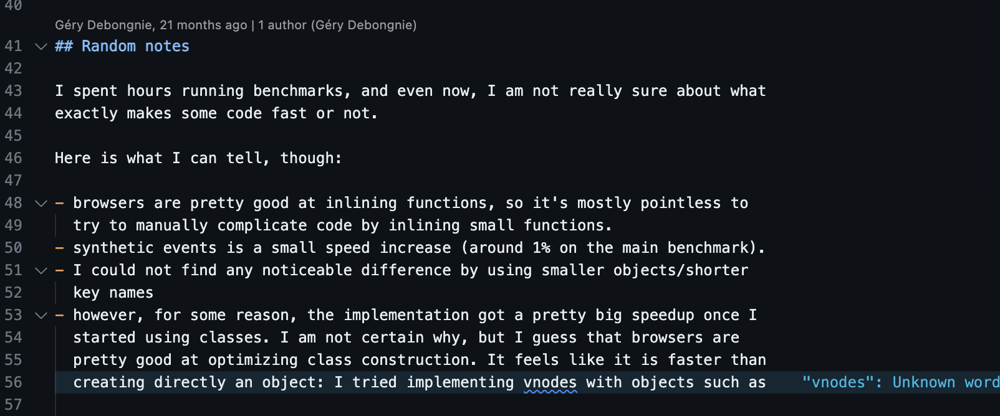

The virtual DOM was created to address performance issues caused by frequent manipulation of the real DOM. It is a lightweight, in-memory representation of the real DOM, which can be later used as reference to update the actual web page.

When a component is rendered, the virtual DOM calculates the difference between the new state and the previous state (a process called "diffing") and makes the minimal set of changes to the real DOM to bring it in sync with the updated virtual DOM (a process called "reconciliation").

but the issue with virtual dom is, if diffing depends on the size of tree, which increases the complexity for big component tree, where only few things are changed but it will compare the whole tree

after virtual dom is overhead movement, new framework came, which don't use virtual dom at all, examples svelte, solid js..., svelte uses dirty checking, and solid uses same but, it only update very part which is changed in dom, they use direct dom manipulation,

how dirty checking works:

1. The framework keeps track of the initial state of the numbers.
2. Whenever an action, like clicking a button, occurs, the framework checks if any of the numbers have changed since the last time it looked.
3. If a number has changed, the framework updates only that specific part of the screen, showing the new value.
4. If no numbers have changed, the framework doesn't do anything, saving time and resources.


while i was figuring things out, i came across [JDOM](https://en.wikipedia.org/wiki/JDOM)
- it is java based document object model 


Island Architecture (Partial Hydration)
- frameworks like Astro and Qwik uses it
- 

we are using Block Dom for this project:
- it uses Static Analysis(does it at compile time) and dirty checking
- rather comparing whole dom tree, it compares specific nodes, and only updates them
- example:
```js
<div> 
	<div>{dynamic}</div>
	Lots and lots of static content...
</div>
```
in above case, only div with dynamic content get checked

we should use block dom when there is dynamic content, if we use it everywhere, there will be no difference between block dom and normal virtual dom 


react saves it's element like this:
```js
const element = {

type: "h1",

props: {

title: "foo",

children: "Hello",

},

}
```

another huge help was reference of [tours](https://thesephist.github.io/torus/api-documentation.html)


- adding web assembly out of the box support in TTDOM, write inside the framework itself
- this idea is very nice

lol

